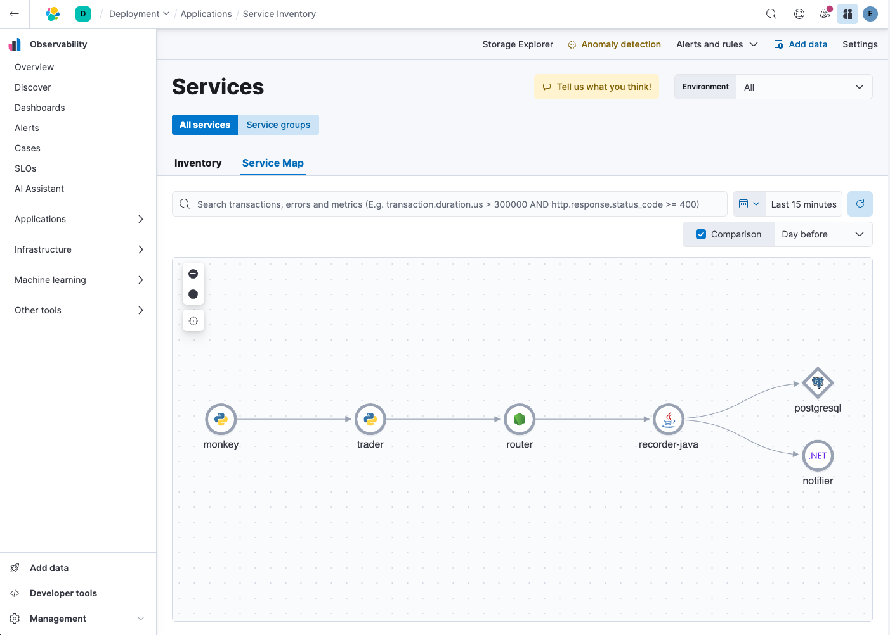

To better appreciate how Elastic can help us quickly and definitively Root Cause Analyze (RCA) problems that arise, we will be working with an example stock trading system, comprised of several services and their dependencies, all instrumented using [OpenTelemetry](https://opentelemetry.io).

We will be working with a live Elasticsearch instance, displayed in the browser tab to the left. We are currently looking at Elastic's dynamically generated Service Map. It shows all of the services that comprise our system, and how they interact with one another.

Our trading system is composed of:
* `trader`: a python application that trades stocks on orders from customers
* `router`: a node.js application that routes committed trade records
* `recorder-java`: a Java application that records trades to a PostgreSQL database
* `notifier`: a .NET application that notifies an external system of completed trades

Finally, we have `monkey`, a python application we use for testing our system that makes periodic, automated trade requests on behalf of fictional customers.

> [!NOTE]
> You are welcome to explore each service and our APM solution by clicking on each service icon in the Service Map and selecting `Service Details`

When you are ready, click the `Next` button to continue.