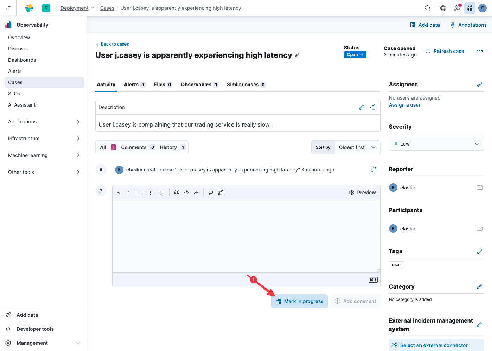

Now let's put ourselves in the shoes of an on-duty Site Reliability Engineer (SRE). We've just been assigned a ticket: apparently a user is complaining of high latency when trying to execute a trade.

In the dark, disconnected age, this would have required a trip to our ticket management system to read and accept responsibility for the ticket. Elastic is all about reducing friction in your workflow, and we recognize that a roundtrip to the ticket management system is likely to result in a loss of fidelity between what's in the SRE's head and the ticket. That loss of fidelity can lead to repeated mistakes.

> [!NOTE]
> Did you know? Elastic can bidirectionally synchronize cases with your [existing ticket and incident management systems](https://www.elastic.co/guide/en/kibana/current/action-types.html)!

1. Click on `User j.casey is apparently experiencing high latency` to select the relevant case
2. Click on `Mark in progress` to let others know that we will handle this one

Great! We've already simplified our workflow: accepting tickets without having to leave our unified observability tool.