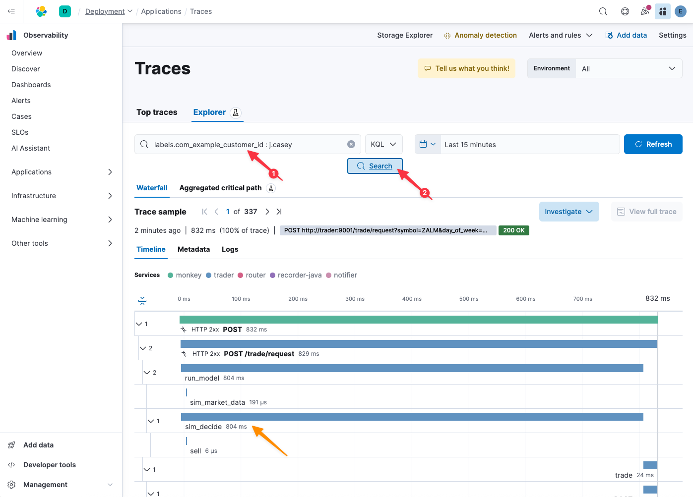
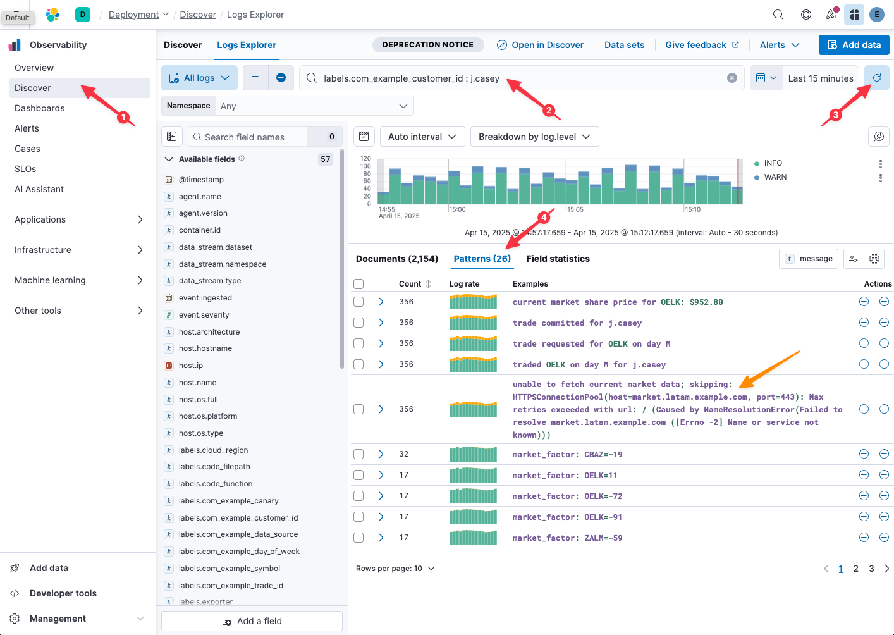

Let's start with what we know: customer `j.casey` is apparently experiencing high latency. Not to doubt `j.casey`, but ... let's confirm that claim with our own telemetry.

How many times have you found yourself wishing you could look at your system's behavior from the perspective of a specific user? That used to be pretty challenging.

Fortunately, with the advent of OpenTelemetry, your engineering team recently made the investment to add auto-instrumentation throughout the trading system. Furthermore, they took the time to augment traces and logs with the same contextual metadata, including customer id.

> [!NOTE]
> Adding the same set of rich, contextual metadata across all of your traces and logs might sound hard, but OpenTelemetry actually makes it easy. Want to learn how you can add metadata _in one place_ and have it _automatically_ propagate to all downstream traces and logs? [Reach out to us](https://www.elastic.co/contact), and we would be happy to share best practices for modern application observability with OpenTelemetry!

# Traces

Let's first confirm the problem from the perspective of available trace data:

1. Copy
    ```kql
    labels.com_example_customer_id : j.casey
    ```
    into the `Filter your data using KQL syntax` search bar toward the top of the Kibana window
2. Click `Search`



We are looking at one sample of a trace into our system from the perspective of j.casey. Indeed, look at the durations in that waterfall graph! Even without understanding what all of the functions do, 800+ ms to run the `sim_decide()` looks highly problematic!

We've confirmed that the problem is real. Think about how easy it was to definitively find an actual trace for j.casey: we didn't have to fumble around with timestamps or other secondary metadata; we just searched for customer id.

# Logs

We know the problem is real, but we are still searching for clues as to why it's happening. To find those clues, it often helps to look at the same problem from multiple perspectives.

Logs tend to carry more verbose errors and warnings, but that same verbosity also makes them difficult to search and make actionable. Fortunately, because OpenTelemetry makes it trivial to add common contextual metadata across traces and logs, our logs are also nicely adorned with the same customer id metadata (no complex and fragile regex required!).

1. Select `Discover` from the Observability navigation menu on the left-hand side
2. Copy
    ```kql
    labels.com_example_customer_id : j.casey
    ```
    into the `Filter your data using KQL syntax` search bar toward the top of the Kibana window
3. Click the Refresh icon
4. Select the `Patterns` tab



We've asked Elastic to bucketize similar looking log patterns, so instead of having to scroll through thousands of repetitive log lines looking for telltale clues, we can quickly appreciate that a given log message is happening with some frequency for `j.casey`.

Hmm... That `unable to fetch current market data` log line sure looks suspicious. I suspect we will see it again as part of our investigation.
