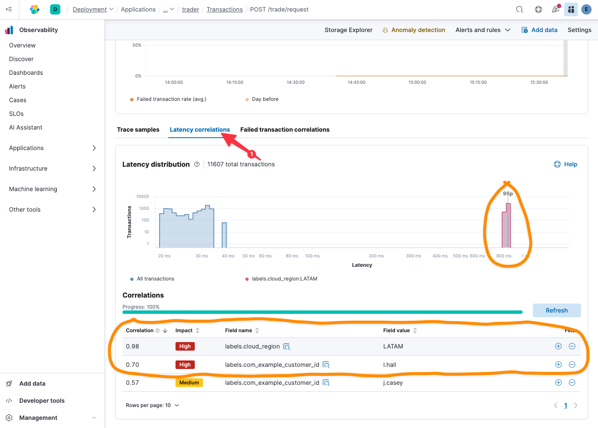

We need to understand the scope of this problem: is this specific to `j.casey`, or is this indicative of a more systemic issue?

While we've been investigating on our own, it looks like one of the SLOs we previously setup in Elastic to automatically monitor our services just tripped! Uh oh - that sounds systemic. Let's get on it!

> [!NOTE]
> In a production system, Elastic would notify you of alerts using any of the many [notification connectors](https://www.elastic.co/guide/en/observability/current/slo-burn-rate-alert.html#action-types-slo) available.

1. Click on the contextual menu `...` under `Actions` and select `View alert details`

Not surprisingly, it looks like the latency SLO we established to monitor our `trader` service has been breached.

1. Under `Latency` / `Metric`, select `95th percentile`

Oh yeah - that looks like a problem. Let's add this alert to the open ticket for context.

2. Click on the contextual menu `...` in the upper-right of the Alert Details
3. Select `+ Add to case`
4. Click `Select` next to the `j.casey` case we are working on

It is easy to take for granted how much Elastic's integration with ticket management not only makes the life of the SRE easier, it encourages them to log rich, contextually relevant evidence to tickets.

So now we have some indication that this likely isn't just a problem for the unfortunate `j.casey`; it looks like we are suffering at least a partial systemic latency problem. Let's follow Elastic's lead and head over to APM to confirm our suspicions:

5. Select `View in APM` on the right side of the `Latency` graph to quickly pivot from the alert to the contextually relevant APM data

This automatically brings us to the APM overview of the `trader` service.

# The power of correlation

1. Scroll down to `Trace samples` and have a look at the latency distribution:

OK - that's good: while there is a sizeable percentage of transactions that are slow (800+ms), there is also clearly a larger balance of transactions that are completing with a reasonable duration (20-30ms).

2. Scroll up to `Failed transaction rate`

Note that there are no transactions failing outright; that's also good news! Perhaps the issue is affecting latency, but not service availability? Notably, that aligns with the alerts we received: our SLO covering service availability was not breached.

Let's leverage Elastic's out-of-the-box statistical analysis to figure out what's unique about these slow transactions:

1. Click on the `Latency correlations` tab next to `Trace samples`

Interesting! It looks like all of the slow transactions are happening in the `LATAM` region. Furthermore, as we suspected, it's not just affecting `j.casey`.

Take a moment to consider what Elastic just did for us: it rooted through all of metadata associated with high latency transactions, and quickly found the common thread: it appears to be affecting just the `LATAM` region. Think about how long it might have taken us to sift through transactions and compare metadata manually to definitively reach that same conclusion.
