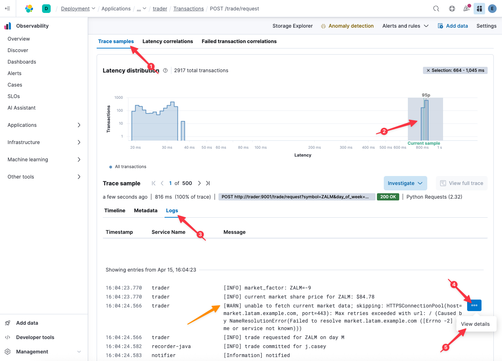
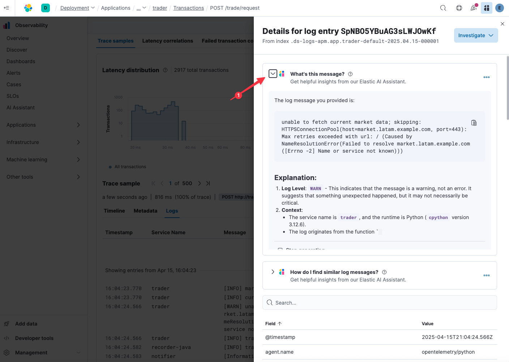
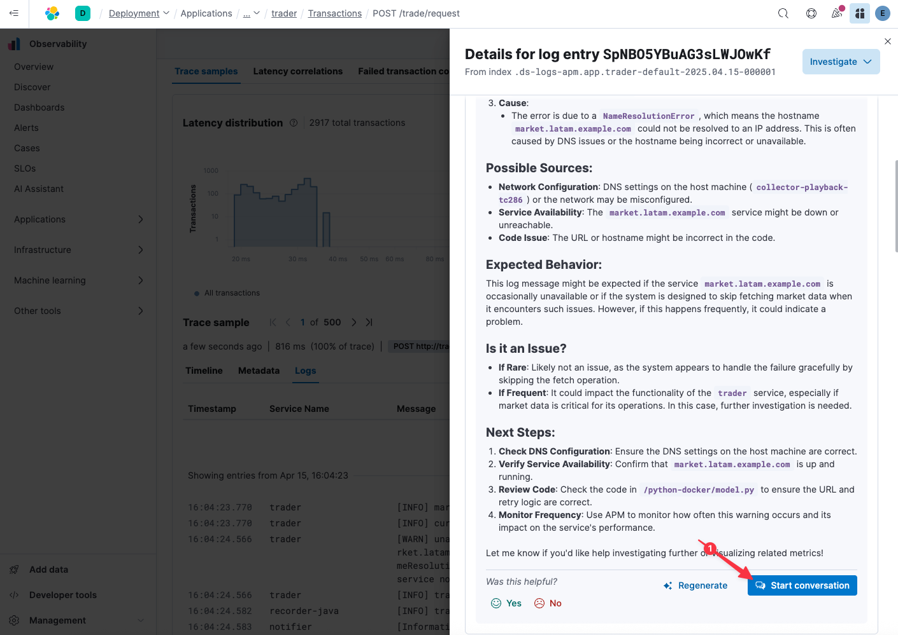

We know we are experiencing latency in the `LATAM` region, but we still don't know what is causing it. Let's have a closer look at those slow transactions:

1. Scroll down to `Trace samples`
2. Click-and-drag to select the cluster of high latency traces
3. Click on the `Logs` tab below `Trace sample` to view the logs associated with this high latency trace

Ah! Look - there's that same `[WARN] unable to fetch current market data...` we saw earlier when analyzing the logs associated with customer `j.casey`.



Look at how easy OpenTelemetry and Elastic make it to correlate logs with traces. Without having to follow timestamps, service ids, and thread ids, we were able to jump directly to the logs contextually related to this exemplary slow span.

> [!NOTE]
> Are you interested in better understanding how you can correlate your traces and logs? [Reach out to us](https://www.elastic.co/contact), and we would be happy to share best practices for modern application observability with OpenTelemetry!

4. Hover over the log entry `[WARN] unable to fetch current market data...` and click on the three dots to the right
5. Select `View details`

# RCA'ing with AI Assistance

Getting to the Root Cause of a complex issue requires broad domain knowledge. Seasoned SREs often acquire that knowledge through time and experience. What if you could surface the contextually relevant parts of that knowledgebase to every SRE and developer on every issue they encounter? Imagine how that could normalize your Mean Time To Resolution (MTTR), regardless of which SRE is on-call.

1. Expand the section `What's this message?`

The Elastic AI Assistant makes quick work of deciphering this log line. Keeping with the theme of reducing friction, this step alone just saved your SREs from having to copy and paste that log line into an external search engine or Large Language Model (LLM). Moreover, because the AI Assistant understands the _context_ in which the exception occurred, it can provide a lot more detail to help your developers quickly address a problem. For example, under `Source`, you'll note that the AI Assistant knows specifically what service has generated this message.



Scroll down to the bottommost sections; that's unexpected! How could it possibly presume that `market.latam.example.com` hasn't yet been provisioned? And moreover, how could it know we should contact the DevOps team for provisioning services? That information is typically found in company-specific issues, tickets, and runbooks.

The magic lies in the database underlying *all* of Elastic's solutions. Elasticsearch supports [vector search](https://www.elastic.co/what-is/vector-search) and [semantic search](https://www.elastic.co/guide/en/elasticsearch/reference/current/semantic-search.html) out of the box. These technologies let Elasticsearch periodically index your existing knowledgebases ([external ticketing systems, configuration management systems, wikis, and other sources](https://www.elastic.co/guide/en/kibana/current/action-types.html)) and contextually draw upon that knowledge when trying to solve a problem. In this case, Elasticsearch is drawing upon knowledge it gleaned from reading issues in our private GitHub repository covering the source code for the services in this system.

Think of how much more helpful that explanation was versus what you might get back with a trivial web search. Thanks to the Elastic AI Assistant, we have a pretty good idea of what's going on here:
* users in the `LATAM` region are experiencing high latency, but not failed transactions
* it appears a host that normally provides current market conditions may not yet have been provisioned in the `LATAM` region
* we should reach out to the DevOps team to provision it

Getting all of that information from the AI Assistant's introspection of a single log line is an incredible leap forward in democratizing domain expertise across your SREs.

# Dialoguing with your data

Now that you know the art of the possible, don't you wish you could have just jumped right to the AI Assistant, had a conversation with your data, and skipped some of the manual fact checking? Let's give it a try!

1. Click `Start conversation` to get started



Let's ask the AI Assistant to confirm something we've already learned otherwise:

2. Copy the question below into the text box that reads `Send a message to the Assistant` and press enter
    ```
    is this log message occurring in every region?
    ```

Perfect! With the ease of a natural language question, the AI Assistant told us what we previously determined using latency correlation: this issue is specifically affecting _only_ the `LATAM` region.

Now let's ask it something we don't yet know, but would be really helpful to understand impact:

3. Copy the question below into the text box that reads `Send a message to the Assistant` and press enter
    ```
    can you compare revenue from the LATAM region to other regions around the time of this incident?
    ```

This is powerful stuff: the AI Assistant can correlate your business KPIs with issues! This particular KPI (revenue per region) is simply an OpenTelemetry metric generated by our trading application. Rather than having to pivot to another tool and align timestamps and region data, we can simply ask Elastic to do the heavy lifting for us and get us to what we ultimately want to know: did this issue impact revenue?

Now let's close the case: we _know_ from the AI Assistant (which in turn learned from our own knowledgebase) that this error can occur when a region is not yet fully provisioned.

So, let's just ask it: is LATAM provisioned?

4. Copy the question below into the text box that reads `Send a message to the Assistant` and press enter
    ```
    what is the status of provisioning the LATAM region?
    ```

Yup! That confirms our suspicion: `LATAM` is still in the process of being provisioned. As before, Elastic's AI Assistant used Elasticsearch's state of the art semantic search engine to find the related ticket in our GitHub repository and use it to answer our question.

Our conversation with the AI Assistant contains a lot of details relevant to our Root Cause Analysis. It is all too easy as a SRE to invest a lot of time in debugging a problem, only to spend very little time documenting that work to help ensure it doesn't happen again. Thankfully, with Elastic, we can simply ask the AI Assistant to summarize our findings and automatically attach them to the relevant ticket.

5. Copy the question below into the text box that reads `Send a message to the Assistant` and press enter
    ```
    can you summarize this discussion and append it to the open case for j.casey?
    ```

Between surfacing contextually relevant logs, GitHub issues, and business KPIs, the Elastic AI Assistant was able to lead us to definitely Root Cause this problem. Furthermore, it gave us the confidence that, while not ideal, the issue is limited in scope and effect. Finally, it summarized our work and automatically updated the open ticket to ensure everyone can learn from this experience.

Its greatest superpower is being able to surface the right information at the right time to answer the questions posed by your SREs, whether seasoned or new to the job.
