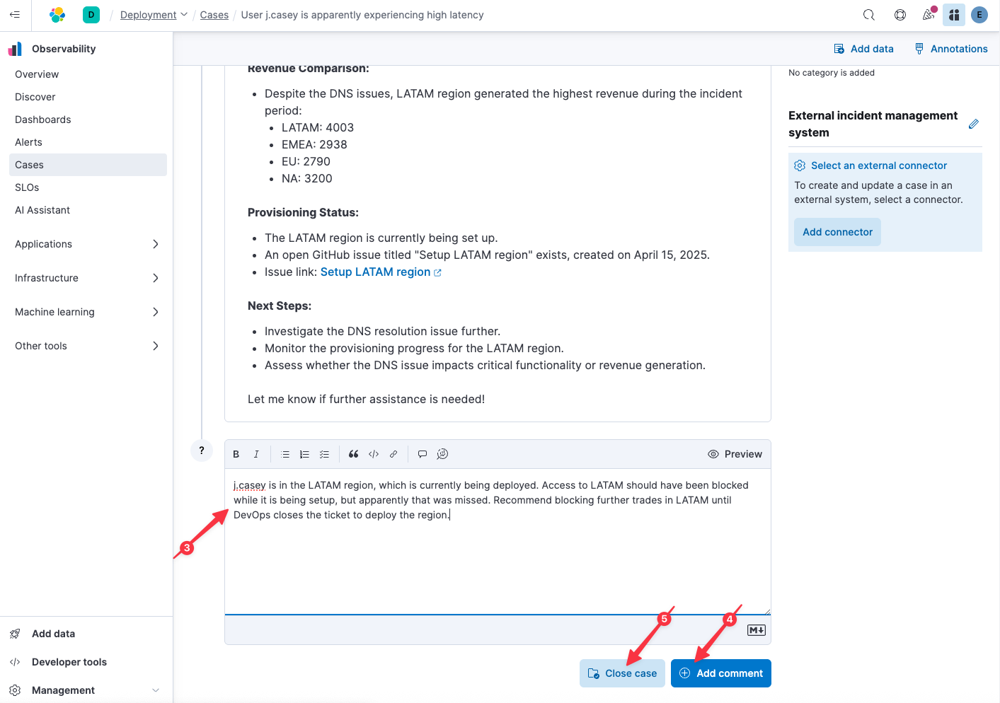

Let's recap what we did to RCA this issue all while staying in a single observability tool:
* confirmed j.casey's issue using trace data
* identified an abnormal log line associated with j.casey's session
* used latency correlation to determine that the issue is affecting all users in `LATAM` (but not other regions)
* used APM availability data to determine that the issue wasn't affecting availability (only latency)
* used AI Assistance to determine (from open issues and our runbook) that this can happen when a new region is setup
* used AI Assistance to confirm that `LATAM` is in the process of being setup

All that remains is for us to update the active Case with our findings. Let's take advantage of how easy it is to update tickets without ever leaving Elastic:

1. Close the "AI Assistant" flyout on the right-hand side if it is still open by clicking on the "X" in the upper-right corner
2. Click on `User j.casey is apparently experiencing high latency`
3. Note the summary of our work with the Elastic AI Assistant which was automatically appended to the case (and think about the value of capturing and sharing this information)
4. In the text box at the bottom, type the following:
    ```
    j.casey is in the LATAM region, which is currently being deployed. Access to LATAM should have been blocked while it is being setup, but apparently that was missed. Recommend blocking further trades in LATAM until DevOps closes the ticket to deploy the region.
    ```
5. Click 'Add comment`
6. Click `Close case`



# Congratulations!

You've just cracked the case using the powerful ML and AI fueled tools Elastic is bringing to modern observability workflows.

When you are evaluating observability vendors, be sure to ask:
* what's your support for OpenTelemetry? (we're all in!)
* does your AI Assistant _know_ about issues, tickets, and runbooks in external knowledgebases?
* can I effortlessly pivot between alarms, SLOs, KPIs, cases, logs, traces, and metrics in one tool to reduce friction for my SREs and developers?

In this lab, we've tried to showcase what "good" observability looks like, and the features you should expect from a modern observability platform.

# What's next?

Ready to get started on your own?

Are you new to Elastic? Try a [free Serverless trial](https://www.elastic.co/cloud/serverless): just point your data at us and we'll take care of the rest! Or if you are more comfortable administering Elastic yourself, try a [free Cloud trial](https://www.elastic.co/cloud/cloud-trial-overview).

If you like what you see, please [reach out to us](https://www.elastic.co/contact).
